<h1 align="center">
    <a>Predição de doenças cardiovasculares</a>
</h1>

Modelo elaborado para predição de falhas cardíacas e doenças cardiovasculares.

<h3>Índice</h3>

 • <a href="#business-ctx">Contexto de negócio</a> 
 • <a href="#dataset-desc">Dataset</a> 
 • <a href="#attr-desc">Descrição dos atributos do dataset</a> 
 • <a href="#pre-process">Pré-processamento das variáveis</a> 
 • <a href="#models">Modelagem</a> 
 • <a href="#results">Avaliação de desempenho</a> 
 • <a href="#refs">Distribuição</a> 
 • <a href="#refs">Referências</a>

<h3 id="business-ctx">Contexto de negócio</h3>

"As doenças cardiovasculares são a principal causa de morte no mundo: mais pessoas morrem anualmente por essas enfermidades do que por qualquer outra causa.

Estima-se que 17,9 milhões de pessoas morreram por doenças cardiovasculares em 2016, representando 31% de todas as mortes em nível global. Destes óbitos, estima-se que 85% ocorrem devido a ataques cardíacos e acidentes vasculares cerebrais (AVCs).

Mais de três quartos das mortes por doenças cardiovasculares ocorrem em países de baixa e média renda.

Das 17 milhões de mortes prematuras (pessoas com menos de 70 anos) por doenças crônicas não transmissíveis, 82% acontecem em países de baixa e média renda e 37% são causadas por doenças cardiovasculares" (OPAS/OMS).

<h3 id="dataset-desc">Dataset</h3>

Para a construção do modelo, foi utilizado o seguinte dataset disponível no Kaggle: <a href="https://www.kaggle.com/fedesoriano/heart-failure-prediction">Heart Failure Prediction Dataset</a>.

<h3 id="attr-desc">Descrição dos atributos do dataset</h3>
<table border="1">
    <tr>
        <td>Atributo</td>
        <td>Tipo</td>
        <td>Descrição</td>
    </tr>
    <tr>
        <td>Age</td>
        <td>Numérico</td>
        <td>Idade do paciente em anos.</td>
    </tr>
    <tr>
        <td>Sex</td>
        <td>Binário</td>
        <td>Sexo do paciente [M: Male, F: Female].</td>
    </tr>
    <tr>
        <td>ChestPainType</td>
        <td>Nominal</td>
        <td>Tipo de dor no peito [TA: Typical Angina, ATA: Atypical Angina, NAP: Non-Anginal Pain, ASY: Asymptomatic].</td>
    </tr>
    <tr>
        <td>RestingBP</td>
        <td>Numérico</td>
        <td>Pressão sanguínea em repouso em mmHg (milímetro de mercúrio).</td>
    </tr>
    <tr>
        <td>Cholesterol</td>
        <td>Numérico</td>
        <td>Colesterol em mm/dL (milímetro por decilitro).</td>
    </tr>
    <tr>
        <td>FastingBS</td>
        <td>Binário</td>
        <td>Açucar no sanguem em jejum, 1 se FastingBS > 120 mg/dL senão 0.</td>
    </tr>
    <tr>
        <td>RestingECG</td>
        <td>Nominal</td>
        <td>Resultados de eletrocardiograma em repouso [Normal: Normal, ST: having ST-T wave abnormality (T wave inversions and/or ST elevation or depression of > 0.05 mV), LVH: showing probable or definite left ventricular hypertrophy by Estes' criteria].</td>
    </tr>
    <tr>
        <td>MaxHR</td>
        <td>Numérico</td>
        <td>Frequência cardíaca máxima alcançada, valor numérico entre 60 e 202.</td>
    </tr>
    <tr>
        <td>ExerciseAngina</td>
        <td>Binário</td>
        <td>Angina induzida por exercício [Y: Yes, N: No].</td>
    </tr>
    <tr>
        <td>Oldpeak</td>
        <td>Numérico</td>
        <td>Depressão do segmento ST induzida por exercício em relação ao descanso.</td>
    </tr>
    <tr>
        <td>ST_Slope</td>
        <td>Binário</td>
        <td>Inclinação do pico em exercício do segmento ST [Up: upsloping, Flat: flat, Down: downsloping].</td>
    </tr>
    <tr>
        <td>HeartDisease</td>
        <td>Binário</td>
        <td>Indica se o paciente possuí doença cardíaca [1: heart disease, 0: Normal].</td>
    </tr>
</table>

<h3 id="pre-process">Pré-processamento das variáveis</h3>
<table border="1">
    <tr>
        <td>Variável</td>
        <td>Descrição</td>
    </tr>
    <tr>
        <td>PRE_AGE</td>
        <td>Se "Age" >= 50 então 1 senão normalização linear (max = 50, min = 28).</td>
    </tr>
    <tr>
        <td>PRE_SEX_M</td>
        <td>Se "Sex" igual a "M" então 1 senão 0.</td>
    </tr>
    <tr>
        <td>PRE_SEX_F</td>
        <td>Se "Sex" igual a "F" então 1 senão 0.</td>
    </tr>
    <tr>
        <td>PRE_CHEST_PAIN_TYPE_NAP</td>
        <td>Se "ChestPainType" = "NAP" então 1 senão 0.</td>
    </tr>
    <tr>
        <td>PRE_CHEST_PAIN_TYPE_ATA</td>
        <td>Se "ChestPainType" = "ATA" então 1 senão 0.</td>
    </tr>
    <tr>
        <td>PRE_CHEST_PAIN_TYPE_ASY</td>
        <td>Se "ChestPainType" = "ASY" então 1 senão 0.</td>
    </tr>
    <tr>
        <td>PRE_CHEST_PAIN_TYPE_TA</td>
        <td>Se "ChestPainType" = "TA" então 1 senão 0.</td>
    </tr>
    <tr>
        <td>PRE_RESTING_BP</td>
        <td>Se "RestingBP" > 139 então 1 senão normalização linear (max = 139, min = 80).</td>
    </tr>   
    <tr>
        <td>PRE_CHOLESTEROL_CAT</td>
        <td>Se "Cholesterol" > 239 então 1 senão 0.</td>
    </tr>  
    <tr>
        <td>PRE_CHOLESTEROL</td>
        <td>Se "Cholesterol" > 239 então 1 senão normalização linear (max = 239, min = 85).</td>
    </tr>
    <tr>
        <td>PRE_FASTING_BP</td>
        <td>Valor da coluna "FastingBP" (1 se FastingBS > 120 mg/dL senão 0).</td>
    </tr>
    <tr>
        <td>PRE_RESTING_ECG</td>
        <td>Se "RestingECG" <> "Normal" entçao 0 senão 1.</td>
    </tr>
    <tr>
        <td>PRE_MAX_HR_CAT</td>
        <td>Se "MaxHR" > 128 então 1 senão 0.</td>
    </tr>
    <tr>
        <td>PRE_MAX_HR</td>
        <td>Se "MaxHR" > 128 então 1 senão normalização linear (max = 128, min = 60).</td>
    </tr>
    <tr>
        <td>PRE_EXERCISE_ANGINA</td>
        <td>Se "ExerciseAngina" = 'Y' então 1 senão 0.</td>
    </tr>
    <tr>
        <td>PRE_OLDPEAK</td>
        <td>Normalização linear (max = 6.2, min = -2).</td>
    </tr>
    <tr>
        <td>PRE_ST_SLOPE</td>
        <td>Se "Oldpeak" <> 'Flat' então 1 senão 0.</td>
    </tr>
</table>

<h3 id="models">Modelagem</h3>

Para um melhor entendimento de qual seria o melhor algoritmo para elaboração do modelo, foram testado alguns algoritmos: Naive-Bayes, Decision Tree, RNA, Extra Trees, Random Forest, Bagging com Naive-Bayes e Bagging com Decision Tree. Todos os algoritmos utilizaram as mesmas variáveis pré-processadas e o dataset foi dividido em 75% para treinamento e 25% para teste.

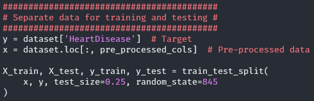

Para cada um dos algoritmos foi passado os seguintes parâmetros:

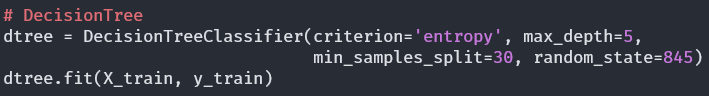
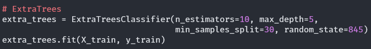
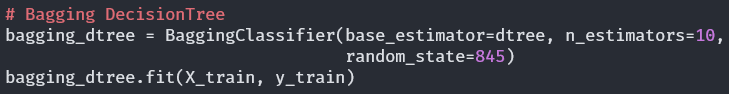
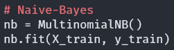
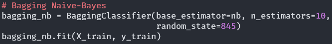
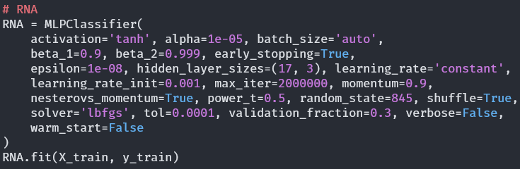
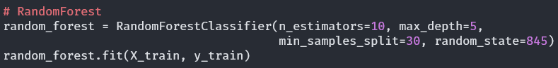

<h3 id="results">Avaliação de desempenho</h3>

Para avaliação de desempenho de cada um dos modelos foi utilizado as funções classification_report e confusion_matrix do pacote de metrics do sklearn e cálculo do MSE.

<h4>Decision Tree</h4>

Relatório de classificação:

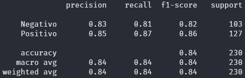

Matriz de confusão:

<table border="1">
    <tr>
        <td></td>
        <td>1</td>
        <td>0</td>
    </tr>
    <tr>
        <td>1</td>
        <td>83</td>
        <td>20</td>
    </tr>
    <tr>
        <td>0</td>
        <td>17</td>
        <td>110</td>
    </tr>
</table>

MSE: 16.08%

<h4>Extra Trees</h4>

Relatório de classificação:

Matriz de confusão:

<table border="1">
    <tr>
        <td></td>
        <td>1</td>
        <td>0</td>
    </tr>
    <tr>
        <td>1</td>
        <td>79</td>
        <td>24</td>
    </tr>
    <tr>
        <td>0</td>
        <td>8</td>
        <td>119</td>
    </tr>
</table>

MSE: 11.71%

<h4>Bagging com Decision Tree</h4>

Relatório de classificação:

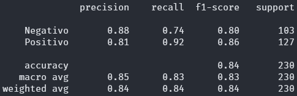

Matriz de confusão:

<table border="1">
    <tr>
        <td></td>
        <td>1</td>
        <td>0</td>
    </tr>
    <tr>
        <td>1</td>
        <td>76</td>
        <td>27</td>
    </tr>
    <tr>
        <td>0</td>
        <td>10</td>
        <td>117</td>
    </tr>
</table>

MSE: 16.08%

<h4>Naive-Bayes</h4>

Relatório de classificação:

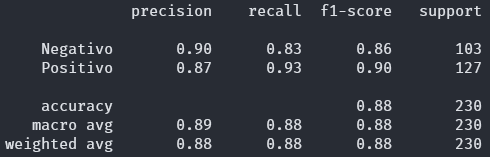

Matriz de confusão:

<table border="1">
    <tr>
        <td></td>
        <td>1</td>
        <td>0</td>
    </tr>
    <tr>
        <td>1</td>
        <td>85</td>
        <td>18</td>
    </tr>
    <tr>
        <td>0</td>
        <td>9</td>
        <td>118</td>
    </tr>
</table>

MSE: 11.73%

<h4>Bagging com Naive-Bayes</h4>

Relatório de classificação:

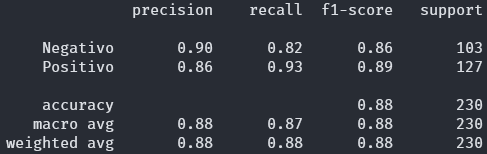

Matriz de confusão:

<table border="1">
    <tr>
        <td></td>
        <td>1</td>
        <td>0</td>
    </tr>
    <tr>
        <td>1</td>
        <td>84</td>
        <td>19</td>
    </tr>
    <tr>
        <td>0</td>
        <td>9</td>
        <td>118</td>
    </tr>
</table>

MSE: 12.17%

<h4>RNA</h4>

Relatório de classificação:

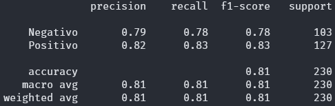

Matriz de confusão:

<table border="1">
    <tr>
        <td></td>
        <td>1</td>
        <td>0</td>
    </tr>
    <tr>
        <td>1</td>
        <td>80</td>
        <td>23</td>
    </tr>
    <tr>
        <td>0</td>
        <td>21</td>
        <td>106</td>
    </tr>
</table>

MSE: 19.13%

<h4>Random Forest</h4>

Relatório de classificação:

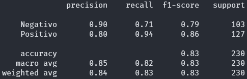

Matriz de confusão:

<table border="1">
    <tr>
        <td></td>
        <td>1</td>
        <td>0</td>
    </tr>
    <tr>
        <td>1</td>
        <td>73</td>
        <td>30</td>
    </tr>
    <tr>
        <td>0</td>
        <td>8</td>
        <td>119</td>
    </tr>
</table>

MSE: 16.52%

A partir das informações acima conseguimos fazer as seguintes observações: 
1. Os modelos Naive-Bayes e Bagging com Naive-Bayes obtiveram a maior acurácia (88%). 
2. O modelo Extra Trees obteve a maior precisão de negativos (91%). 
3. O modelo Naive-Bayes obeteve o melhor recall (83%) e f1-score de negativos (86%), e também a melhor precisão com positivos (87%) e melhor f1-score (90%) com positivos. 
4. Os modelos Extra Trees e Random Forest obtiveram o melhor recall de positivos (94%). 
5. O modelo Extra Trees obteve o menor MSE (11.71%).

Todos os modelos obtiveram resultados muito bons, mas o modelo escolhido pelo trabalho foi o que utilizou o algoritmo Naive-Bayes, pois ele foi um dos algoritmos com melhor acurácia (86%), segundo menor MSE (11.73%) e melhores métricas na predição de positivos.

<h3 id="impl">Distribuição</h3>

O principal objetivo deste trabalho é auxiliar a criação de um modelo para predição de doenças cardiovasculares. A distribuição e implementação dos resultados da pesquisa podem se dar seguintes formas: 
1. Utilização do modelo para auxiliar no diagnóstico junto a especialistas. 
2. Automatização de gatilhos para alertar os pacientes da instituição de saúde. 
3. Base para novas pesquisas e aprimoramentos nos modelos desenvolvidos.

<h3 id="refs">Referências</h3>

1. fedesoriano. (September 2021). Heart Failure Prediction Dataset. Disponível em: https://www.kaggle.com/fedesoriano/heart-failure-prediction. Acesso em: 21 de out. de 2021.

2. Organização Pan-Americana da Saúde. Disponível em: https://www.paho.org/pt/topicos/doencas-cardiovasculares. Acesso em: 23 de nov. de 2021.

